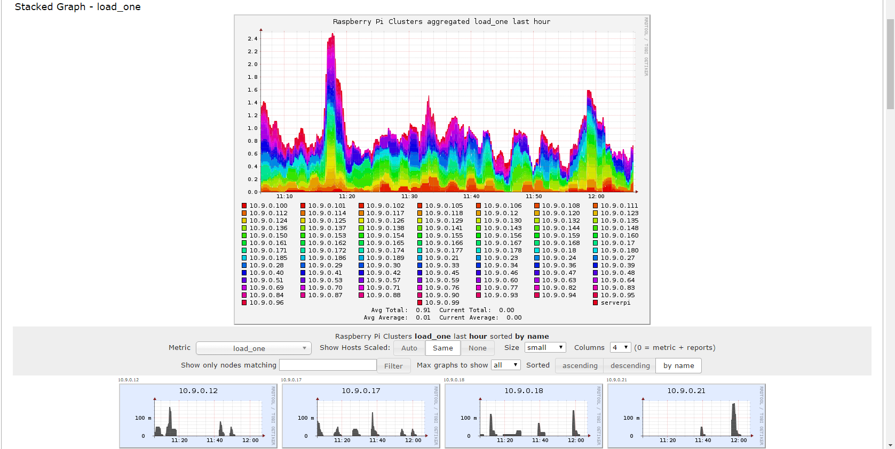

EPSCOR_Bramble_GH9C
===================

## A cluster of Raspberry PIs is generally referred to as a bramble. ##

## Information about the project ##
  * Raspberry PI:
      * 180 Raspberry PIs (rPIs) on a gantry above the greenhouse.
      * Powered by rPI adapters plugged into power strips.
          * Make sure there is no electromagnetic interference by assuring no loops in the power cables.
      * One Raspberry PI (omegabackup) kept outside with monitor and keyboard for quick maintenance.
      * One Raspberry PI (alphabackup) kept for testing new scripts to be sent to rPIs.
      * One Raspberry PI (serverpi) kept to be the server for ganglia. It collects data from the bramble and transmists it to a ganglia host which allows a broad overview of rPI load, uptime, etc. over a given time interval.
      * 
  * Two Wireless Access Points (WAP) specifically dedicated to the bramble and two others simulcasting for a total of 4 SSIDs to subdivide the bramble. Approximately 45 rPIs per WAP.
  * Because of current location there is a lot of wireless interference so the rPIs have their transmit power turned down to 18 db at all times. It is increased back up to 20 db before copying files over.
  * 

